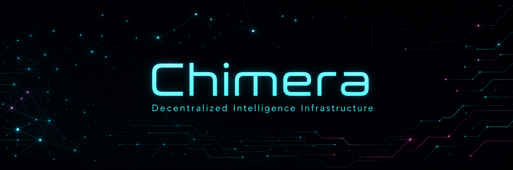

# brand-assets/

Official Chimera brand assets for use across all platforms and marketing materials.

## Files

- **chimeralogo.png** — Primary logo with background (500×500px). Use for favicon, README, and anywhere a square logo is needed
- **chimeralogo-header.png** — Logo with transparent background (500×500px). Use for website headers, nav bars, and dark backgrounds
- **banner2.png** — Hero banner image for landing page and social media

## Usage

### Website
```html
<!-- Header logo (transparent) -->


<!-- Favicon (with background) -->
<link rel="icon" type="image/png" href="chimeralogo.png">

<!-- Hero banner -->

```

### Desktop App
The desktop app icons in `apps/desktop/src-tauri/icons/` are generated from `chimeralogo.png` at build time.

## Colors

- Primary gradient: `#00e5ff` → `#a855f7`
- Background: `#030308`
- Text: `#e8e2d8`
